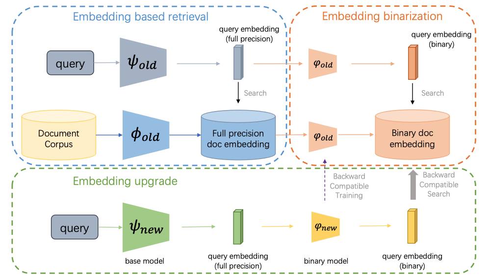

# BEBR

## Approach


## Usage
First, install Pytorch 1.13.1 (or later) and torchvision, as well as some additional depencecices
```bash
conda install pytorch torchvision torchaudio pytorch-cuda=11.6 -c pytorch -c nvidia
pip install -r requirements
```

## Evaluation
Pre-computed hash features, recurrent binary features and float features are provided for evaluation.
```bash
# run evaluation on hash features
python tools/eval.py --image_feat dataset/hash/feat_image.npy --txt_feat dataset/hash/feat_txt.npy

# float features
python tools/eval.py --image_feat dataset/float_finetune/feat_image.npy --txt_feat dataset/float_finetune/feat_txt.npy

# recurrent binary features
python tools/eval.py --image_feat dataset/bebr/feat_image.npy --txt_feat dataset/bebr/feat_txt.npy
```

## Train

